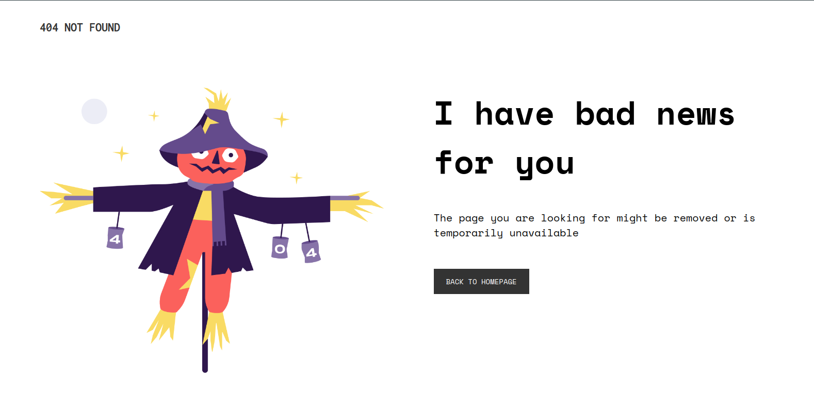
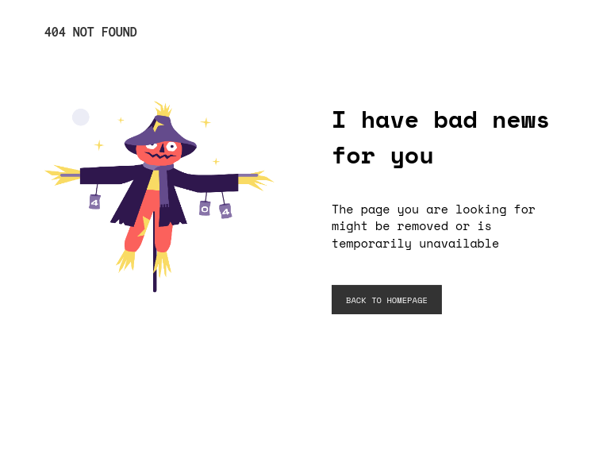
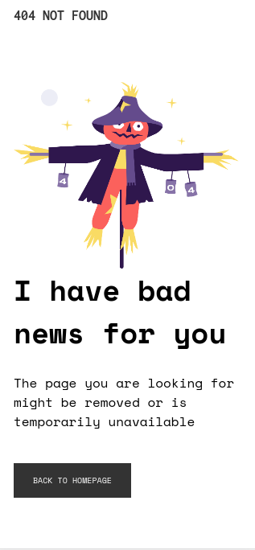

<!-- Please update value in the {}  -->

<h1 align="center">404 NOT FOUND PAGE</h1>

   Solution for a challenge from  <a href="http://devchallenges.io" target="_blank">Devchallenges.io</a>.

  <h3>
    <a href="https://josiashod.github.io/404-not-found-page/">
      Demo
    </a>
     | 
    <a href="https://github.com/josiashod/404-not-found-page.git">
      Solution
    </a>
     | 
    <a href="https://devchallenges.io/challenges/wBunSb7FPrIepJZAg0sY">
      Challenge
    </a>
  </h3>

<!-- TABLE OF CONTENTS -->

## Table of Contents

- [Overview](#overview)
- [Features](#features)
- [Contact](#contact)

<!-- OVERVIEW -->

## Overview

- Where can I see your demo?   You can find the demo on: <a href="https://josiashod.github.io/404-not-found-page/">
      Demo
    </a>
- What was your experience?  I've 2 years f practice
- What have you learned/improved?  I've just learn HTML5 & CSS3

## Features

<!-- List the features of your application or follow the template. Don't share the figma file here :) -->

This application/site was created as a submission to a [DevChallenges](https://devchallenges.io/challenges) challenge. The [challenge](https://devchallenges.io/challenges/wBunSb7FPrIepJZAg0sY) was to build a 404 not found page.

## Contact

- GitHub [@josiashod](https://github.com/josiashod)
- Twitter [@josias_hod](https://twitter.com/josias_hod)
